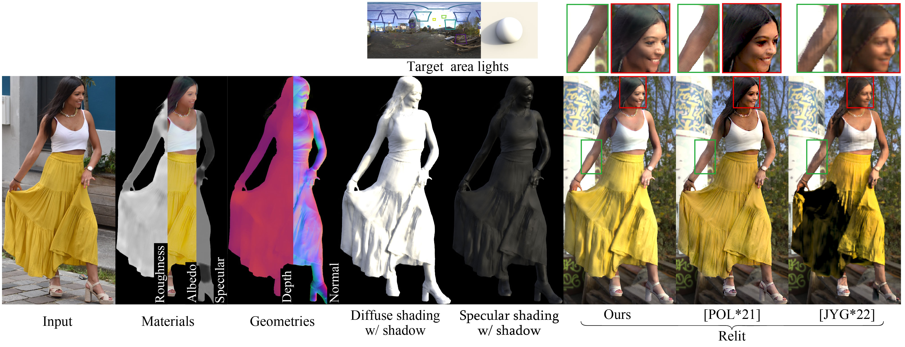

# All-frequency Full-body Human Image Relighting



This code is our implementation of the following paper:

Daichi Tajima, Yoshihiro Kanamori, Yuki Endo: "All-frequency Full-body Human Image Relighting," Computer Graphics Forum (Proc. of Eurographics 2025), 2025. [[Project]](https://www.cgg.cs.tsukuba.ac.jp/~tajima/pub/all-frequency_full-body_human_image_relighting/index.html)[[PDF]](https://arxiv.org/abs/2411.00356)

# Getting Started

## Requirements
- Python 3.10.15 (tested)
- [nvdiffrast](https://github.com/NVlabs/nvdiffrast) 0.3.3 (tested)
- PyTorch 2.5.1 (tested)
- tqdm
- torchvision
- numpy
- opencv
- kornia
- lpips

Except for nvdiffrast, you can install by executing the following:
```
pip install -r requirements.txt 
```
Note: A GPU with at least 10GB of memory is recommended to run our model.

## Pretrained models
Please download pretrained models from the following links.
https://drive.google.com/drive/folders/17sE-nQEOgIL8KeWcD_CLFlH5MMo-0JP2?usp=sharing


## Inference
```
python eval_real.py --img_dir ./data/test_imgs --als_dir ./data/test_lights --out_dir ./outputs/eval_real --checkpoint_path_firststage FIRSTSTAGE_MODEL_PATH --checkpoint_path_depth DEPTH_MODEL_PATH --checkpoint_path_refineshadow REFINESHADOW_MODEL_PATH --device cuda
```
where
- img_dir: `./data/test_imgs` contains three pre-defined person images and their binary masks.
- als_dir: `./data/test_lights` contains three pre-defined illumination data.
- out_dir: Output directory for relighting results
- checkpoint_path_firststage: Downloaded model path
- checkpoint_path_depth: Downloaded model path
- checkpoint_path_refineshadow: Downloaded model path
- device: cuda or cpu


# To use your own data


## Human images
Place the full-body human image and its binary mask as shown below.

    .
    └── IMG_DIR
        └── img_name
            ├── input_w_bg.jpg
            └── mask.png


## Illuminations
Place the environment map (.hdr) you want to use in the desired directory ENV_DIR.

To extract the illumination data from the desired environment map, the reference sphere data is first rendered using the code below.
```
python generate_sphere.py --out_dir OUT_SPHERE_DIR --env_dir ENV_DIR
```

Next, the rendered data is used to optimise the lighting data.
```
python optimize_als.py --out_dir OUT_ALS_DIR --env_dir ENV_DIR --sphere_dir OUT_SPHERE_DIR --device cuda
```

## Inference
```
python eval_real.py --img_dir IMG_DIR --als_dir OUT_ALS_DIR --out_dir ./outputs/eval_real --checkpoint_path_firststage FIRSTSTAGE_MODEL_PATH --checkpoint_path_depth DEPTH_MODEL_PATH --checkpoint_path_refineshadow REFINESHADOW_MODEL_PATH --device cuda
```


# Training
## Prepare human image dataset
The following data are required as a minimum for learning.

    .
    └── IMG_DATASET_DIR
        ├── (human id)
        │   ├── albedo.png
        │   ├── specular.png
        │   ├── roughness.png
        │   ├── normal.png
        │   ├── depth.exr
        │   ├── mask.png
        │   ├── (env name a)__(rotation angle)
        │   │   ├── rendering_w_shadow_w_specular.png
        │   │   ├── rendering_wo_shadow_w_specular.exr
        │   │   ├── diffuse_shading_wo_shadow.exr
        │   │   ├── diffuse_shading_w_shadow.exr
        │   │   └── specular_shading_wo_shadow.exr
        │   ├── (env name b)__(rotation angle)
        │       └── ...
        ├── ...


The human image dataset created from [human generator v3](https://www.humgen3d.com/) can be downloaded from the following link.

(COMING SOON...)

Note: Our model also uses datasets other than those listed above for training. See our paper for more details.

## Prepare illumination dataset
We use environment maps downloaded in hdr format from [Poly Haven](https://polyhaven.com/hdris).
The method of creation is the same as described in the [Illuminations](#illuminations) section above.

## Training
To train the first stage of the inverse rendering network in the paper, run the following code.
```
python train_firststage.py --out_dir ./outputs/train_firststage --amp --train_sigma --dataset_dir IMG_DATASET_DIR --als_dir ALS_DATASET_DIR --batch_size 8 --device cuda
```

To train the second stage of the depth estimation network in the paper, run the following code.
```
python train_depth.py --out_dir ./outputs/train_depth --dataset_dir IMG_DATASET_DIR --batch_size 8 --device cuda
```

To train the second stage of the shadow refinement network in the paper, run the following code.
```
python train_refineshadow.py --out_dir ./outputs/train_refineshadow --amp --dataset_dir IMG_DATASET_DIR --als_dir ALS_DATASET_DIR --batch_size 8 --device cuda
```


# Citation
Please cite our paper if you find the code useful:
```
@article{tajimaEG25,
  author    = {Daichi Tajima,
               Yoshihiro Kanamori,
               Yuki Endo},
  title     = {All-frequency Full-body Human Image Relighting},
  journal   = {Computer Graphics Forum (Proc. of Eurographics 2025)},
  volume    = {},
  number    = {},
  pages     = {--},
  year      = {2025}
}
```
